# 🏛️ Awesome Reference Data Management (RDM) & Master Data Management (MDM)

<p align="center">
  
</p>

<p align="center">
  <a href="https://github.com/ishandutta2007/Awesome-Awesome-Awesome"></a><a href="https://discord.gg/jc4xtF58Ve"></a>
  <a href="https://github.com/ishandutta2007/Awesome-Reference-Data-Management/stargazers"></a>
  <a href="https://github.com/ishandutta2007/Awesome-Reference-Data-Management/network/members"></a>
  <a href="https://github.com/ishandutta2007/Awesome-Reference-Data-Management/pulls"></a>
  <a href="https://opensource.org/licenses/MIT"></a>
  <a href="https://github.com/ishandutta2007"></a>
</p>

---

## 📖 Overview

A comprehensive, SEO-optimized, curated collection of enterprise **SaaS platforms**, **hosted solutions**, and **open-source frameworks** for **Reference Data Management (RDM)**, **Master Data Management (MDM)**, **Golden Record Generation**, **Entity Resolution**, **Data Stewardship**, and **Multi-Domain Data Governance**.

Reference data and master data form the foundational backbone for mission-critical enterprise systems across capital markets, banking, healthcare, commerce, and global supply chains. Whether building financial security master repositories, harmonizing ISO 20022 and LEI standard codes, reconciling customer 360 profiles, or establishing survivorship rules for golden records, this index catalogs the industry-leading technologies.

---

## 📑 Table of Contents

- [🏛️ Overview](#-overview)
- [📊 Market Landscape & SaaS Platforms](#-market-landscape--saas-platforms)
  - [Market Size & Industry Dynamics](#market-size--industry-dynamics)
  - [SaaS & Hosted Platforms Comparison](#saas--hosted-platforms-comparison)
- [💻 Open-Source GitHub Projects](#-open-source-github-projects)
- [🧩 Architectural Categories & Reference Patterns](#-architectural-categories--reference-patterns)
- [🤝 How to Contribute](#-how-to-contribute)
- [📈 Star History](#-star-history)
- [⚖️ Disclaimer](#️-disclaimer)

---

## 📊 Market Landscape & SaaS Platforms

### Market Size & Industry Dynamics

> 💡 **Market Size & Structure**: The global Master Data Management (MDM) and Reference Data Management (RDM) market is estimated at **$19.24 Billion in 2025** and projected to reach **$22.55 Billion in 2026** (CAGR of ~14.2%), situated within a broader Enterprise Data Management (EDM) software sector exceeding **$130 Billion**. The sector is **moderately fragmented**: enterprise incumbents (Cloud Software Group/TIBCO, Informatica) maintain extensive market presence, while agile cloud-native multi-domain providers (Reltio, Semarchy, Ataccama, Profisee) and specialized financial reference data powerhouses (GoldenSource, SmartStream, NeoXam, RIMES, Alveo) hold formidable domain moats, precluding a winner-take-all dynamic.

### SaaS & Hosted Platforms Comparison

*Sorted in descending order by company scale (valuation / annual revenue).*

| Platform | Company Size (Valuation / Revenue) | Starting Tier Pricing | Free Tier / Trial Limits | Key Domain Focus |
| :--- | :--- | :--- | :--- | :--- |
| 🌐 **[TIBCO EBX](https://www.tibco.com/products/tibco-ebx-software)** | **$16.5B Valuation** / $3.2B Rev *(Cloud Software Group)* | **$2,500/month** (AWS/Azure Marketplace base instance) | **30-day free trial** with full multi-domain feature access on AWS/Azure | Multi-domain MDM, reference data hierarchies, workflow orchestration & compliance |
| 🌐 **[Informatica MDM](https://www.informatica.com/products/master-data-management.html)** | **$8.5B Valuation** / $1.64B Rev *(NYSE: INFA)* | **$2,000/month** (IDMC Cloud MDM / IPU capacity entry) | **30-day free trial** on Intelligent Data Management Cloud with pre-loaded samples | AI-driven multi-domain MDM (CLAIRE AI), 360-degree views, matching & governance |
| 🌐 **[Reltio](https://www.reltio.com/)** | **$1.7B Valuation** / $130M ARR | **$2,500/month** (Connected Data Platform AWS base tier) | **30-day free trial** on AWS supporting up to 100,000 profile records | Real-time multi-domain MDM, graph-connected customer 360 & entity resolution |
| 🌐 **[RIMES Technologies](https://www.rimes.com/)** | **$800M Valuation** / $80M Rev *(Backed by EQT)* | **$3,000/month** (Benchmark Data Service entry tier) | **30-day proof-of-value sandbox** with live global benchmark & index feeds | Capital markets reference data, benchmark curation & ESG data feed normalization |
| 🌐 **[Ataccama ONE](https://www.ataccama.com/)** | **$550M Valuation** / $100M ARR *(Backed by Bain Capital)* | **$1,250/month** (Ataccama ONE Cloud starting tier) | **30-day free trial** of Ataccama ONE Cloud with 5 enterprise source connectors | Unified data governance, automated data quality fabric & reference data authoring |
| 🌐 **[Stibo STEP](https://www.stibosystems.com/)** | **$140M Annual Revenue** *(Stibo Systems)* | **$3,500/month** (Enterprise SaaS base subscription) | **30-day guided interactive sandbox** with pre-configured domain templates | Multi-domain MDM, Product Information Management (PIM), customer & vendor master |
| 🌐 **[SmartStream RDU](https://www.smartstream-rdu.com/)** | **$115M Annual Revenue** *(SmartStream Tech)* | **$3,000/month** (Reference Data Utility API tier) | **30-day API sandbox evaluation** with simulated capital market instruments | Financial Security Master, legal entity identifiers (LEI), MiFID II & SFTR compliance |
| 🌐 **[NeoXam DataHub](https://www.neoxam.com/solutions/neoxam-datahub/)** | **$90M Annual Revenue** | **$3,500/month** (EDM DataHub core financial tier) | **30-day test drive sandbox** with pre-configured capital market feeds | Financial enterprise data management, securities reference data & corporate actions |
| 🌐 **[GoldenSource](https://www.thegoldensource.com/)** | **$65M Annual Revenue** | **$4,000/month** (GoldenSource OnDemand SaaS entry) | **30-day managed sandbox environment** with financial market data validation feeds | Golden record security master, instrument reference data, pricing & corporate actions |
| 🌐 **[Profisee](https://profisee.com/)** | **$55M Annual Revenue** *(Primavera Capital)* | **$2,000/month** (Azure Marketplace MDM starting tier) | **30-day free test drive** on Microsoft Azure Marketplace | Turnkey Azure/Fabric/Purview integration, fast multi-domain MDM & data stewardship |
| 🌐 **[Alveo](https://www.alveotechnology.com/)** | **$45M Annual Revenue** *(Formerly Asset Control)* | **$2,800/month** (Alveo Prime Cloud base tier) | **30-day proof-of-concept cloud trial** with sample market data workflows | Financial market data integration, pricing master, curve scrubbing & regulatory RDM |
| 🌐 **[Semarchy xDM](https://www.semarchy.com/)** | **$40M Annual Revenue** | **$1,500/month** (AWS/Azure Marketplace ~$2.05/hour) | **14-day free trial** on AWS and Microsoft Azure Cloud Marketplaces | Unified Master Data Management, zero-code stewardship applications & deduplication |

---

## 💻 Open-Source GitHub Projects

*Sorted in descending order by GitHub Stars. Each repository includes a live social badge linking directly to its stargazers.*

- ### 🌟 **[OpenRefine](https://github.com/OpenRefine/OpenRefine)** [](https://github.com/OpenRefine/OpenRefine/stargazers)
  The premier free and open-source data manipulation and cleansing tool. Features powerful reference data reconciliation against standard knowledge graphs (Wikidata), entity resolution, facets, and GREL-based transformation expressions.

- ### 🌟 **[Dedupe](https://github.com/dedupeio/dedupe)** [](https://github.com/dedupeio/dedupe/stargazers)
  Python library that applies active machine learning to perform deduplication, entity resolution, and record linkage. Crucial for matching disparate data sources and synthesizing unified golden records.

- ### 🌟 **[Pimcore MDM](https://github.com/pimcore/pimcore)** [](https://github.com/pimcore/pimcore/stargazers)
  Full-featured open-source enterprise platform providing multi-domain Master Data Management (MDM), Product Information Management (PIM), Digital Asset Management (DAM), and Customer Data Platform (CDP) capabilities.

- ### 🌟 **[Splink](https://github.com/moj-analytical-services/splink)** [](https://github.com/moj-analytical-services/splink/stargazers)
  Fast, ultra-scalable probabilistic record linkage and entity resolution library developed by the UK Ministry of Justice. Scales to hundreds of millions of records using DuckDB, Apache Spark, or AWS Athena.

- ### 🌟 **[Zingg](https://github.com/zinggAI/zingg)** [](https://github.com/zinggAI/zingg/stargazers)
  Production-grade, ML-powered entity resolution and deduplication framework built for Apache Spark and modern data lakes/warehouses (Snowflake, Databricks). Builds reliable 360-degree customer and entity golden records.

- ### 🌟 **[DataCleaner](https://github.com/datacleaner/DataCleaner)** [](https://github.com/datacleaner/DataCleaner/stargazers)
  Enterprise data profiling, validation, and hygiene engine. Provides visual workflows to discover anomalies, monitor reference code conformity, and validate master data pipelines.

- ### 🌟 **[AtroCore](https://github.com/atrocore/atrocore)** [](https://github.com/atrocore/atrocore/stargazers)
  Open-source, highly modular Business Application Platform designed from the ground up for Master Data Management (MDM), Reference Data catalogs, and PIM. Supports flexible entity relations, survivorship rules, and custom REST APIs.

- ### 🌟 **[GoldenMatch](https://github.com/benseverndev-oss/goldenmatch)** [](https://github.com/benseverndev-oss/goldenmatch/stargazers)
  High-performance zero-configuration Python library for entity resolution, probabilistic matching, and automated golden record consolidation across messy tabular datasets.

- ### 🌟 **[Fuyuko](https://github.com/tmjeee/fuyuko)** [](https://github.com/tmjeee/fuyuko/stargazers)
  Modern open-source Master Data Management and Product Information Management web application built for managing complex domain schemas, classifications, and master entities.

- ### 🌟 **[Eclipse BPDM](https://github.com/eclipse-tractusx/bpdm)** [](https://github.com/eclipse-tractusx/bpdm/stargazers)
  Eclipse Tractus-X Business Partner Data Management service. Provides microservices and persistent infrastructure for the automated generation and lifecycle management of legal entity "Golden Records".

- ### 🌟 **[AURUM](https://github.com/RajaMDM/AURUM)** [](https://github.com/RajaMDM/AURUM/stargazers)
  Vendor-agnostic reference implementation covering the complete MDM lifecycle: raw data ingestion, profiling, matching, survivorship rules, golden record generation, and stewardship task routing.

- ### 🌟 **[RDataCore](https://github.com/BentBr/r_data_core)** [](https://github.com/BentBr/r_data_core/stargazers)
  Self-hosted master data management engine written in Rust. Features a dynamic entity modeling system, workflow triggers, immutable audit versioning, and high-throughput REST APIs.

- ### 🌟 **[open-mdm](https://github.com/open-mdm/open-mdm)** [](https://github.com/open-mdm/open-mdm/stargazers)
  Microservices architecture prototype for core hub-style master data management, dynamic schema validation, and real-time pub/sub event distribution.

---

## 🧩 Architectural Categories & Reference Patterns

Building an enterprise reference or master data stack generally incorporates components across five core pillars:

```
  ┌─────────────────────────────────────────────────────────────┐
  │                 DATA CONSUMERS & APPLICATIONS               │
  │     (Trading Systems, CRM, ERP, BI Analytics, AI Models)    │
  └──────────────────────────────▲──────────────────────────────┘
                                 │ Clean APIs / Event Streams
  ┌──────────────────────────────┴──────────────────────────────┐
  │               GOLDEN RECORD & RDM CONTROL PLANE             │
  │  • Survivorship Logic             • Hierarchy & Taxonomy     │
  │  • Golden Record Synthesis        • Data Stewardship Portal  │
  └──────────────────────────────▲──────────────────────────────┘
                                 │
  ┌──────────────────────────────┴──────────────────────────────┐
  │              MATCHING & ENTITY RESOLUTION ENGINE            │
  │  • Probabilistic Linkage (Splink) • ML Deduplication (Zingg) │
  │  • Deterministic Rules            • Graph Resolution         │
  └──────────────────────────────▲──────────────────────────────┘
                                 │
  ┌──────────────────────────────┴──────────────────────────────┐
  │               DATA QUALITY & PROFILING FABRIC               │
  │  • Great Expectations             • DataCleaner / Soda       │
  │  • OpenRefine Reconciliation      • Standard Code Lists      │
  └──────────────────────────────▲──────────────────────────────┘
                                 │ Ingestion & Feeds
  ┌─────────────────────────────────────────────────────────────┐
  │               HETEROGENEOUS ENTERPRISE SOURCES              │
  │     (Bloomberg, Refinitiv, Salesforce, SAP, Internal DBs)   │
  └─────────────────────────────────────────────────────────────┘
```

1. **Deterministic & Probabilistic Entity Resolution**:
   - Machine learning entity resolution libraries like [Splink](https://github.com/moj-analytical-services/splink), [Dedupe](https://github.com/dedupeio/dedupe), and [Zingg](https://github.com/zinggAI/zingg) detect matching records across disparate data sources without requiring uniform primary keys.
2. **Data Reconciliation & External Standards**:
   - [OpenRefine](https://github.com/OpenRefine/OpenRefine) and [DataCleaner](https://github.com/datacleaner/DataCleaner) allow reconciling codes against external standards (ISO 3166 country codes, ISO 4217 currencies, LEI, ISIN, CUSIP, FIGI).
3. **Multi-Domain MDM Platforms**:
   - Turnkey suites like [Pimcore](https://github.com/pimcore/pimcore) and [AtroCore](https://github.com/atrocore/atrocore) provide operational data stewardship, data model definitions, and UI approval workflows for domain entities.
4. **Capital Markets Reference Data Utilities**:
   - Specialized systems (GoldenSource, NeoXam, SmartStream, RIMES, Alveo) manage real-time feeds, corporate action scrubbers, instrument hierarchies, and legal entity mapping.
5. **Enterprise Cloud MDM**:
   - Modern enterprise cloud platforms (Reltio, Informatica MDM, TIBCO EBX, Semarchy, Ataccama, Profisee) deliver multi-tenant SaaS, distributed graph modeling, and AI-driven match-and-merge pipelines.

---

## 🤝 How to Contribute

Contributions to expand this ecosystem are very welcome!

1. 🍴 **Fork** this repository.
2. 🌿 Create a new feature branch (`git checkout -b feature/add-tool`).
3. 📝 Add your entry ensuring:
   - For **SaaS platforms**: include company scale (valuation/revenue), specific entry-tier pricing, and specific free tier / trial days and limits.
   - For **Open-source projects**: include the official GitHub repo link and social star badge linked to the stargazers page.
4. 🚀 Open a **Pull Request** with a concise description of the platform's architectural fit.

---

## 📈 Star History

[](https://star-history.dera.page/#ishandutta2007/Awesome-Reference-Data-Management&type=date&legend=top-left)

---

## ⚖️ Disclaimer

- This repository is a **community-curated index** for informational and educational purposes. Mention of specific vendors or products does not constitute an endorsement.
- Reference and master data management systems govern critical financial, operational, and regulatory processes. Ensure comprehensive security, data sovereignty, audit trail, and total cost of ownership (TCO) evaluation when selecting solutions.

---

<p align="center">
  <b>Curated with ❤️ for enterprise data architects, master data stewards, and quantitative teams worldwide.</b>
</p>
